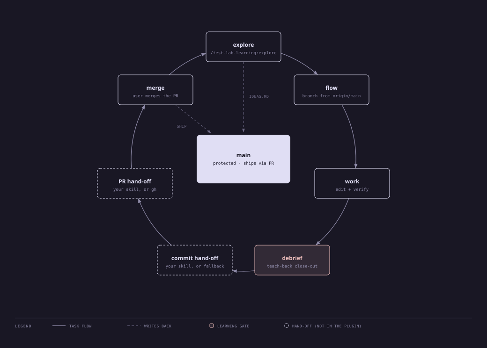

# development-learning-workflow

A Claude Code plugin that turns each coding task into a small learning loop.
Branch first.
Study a concept when one comes up, ship the work,
then close with a debrief that teaches you the diff you just wrote.

I built it for my test labs.
The [dbt Cloud test lab](https://github.com/mpoirault/dbt-cloud-test-lab) is the example that uses it.
The repo is public because the skills are not tied to dbt or to my setup, so others can install them too.



## What it does

The plugin ships three skills and one hook.

- `flow` runs before the first edit of any task.
  It creates a `type/kebab-slug` branch from the fresh `origin/main` tip
  and routes the end of the task: debrief first, then the commit hand-off.
- `explore` is typed as `/test-lab-learning:explore <topic or url>`.
  It grounds the facts, gives a briefing in chat,
  builds one self-contained concept page under `explorations/`,
  and forces a verdict: implement now, park, or drop.
  Every verdict lands in `IDEAS.md`. A parked idea keeps its page.
- `debrief` fires when a task reaches its stopping point.
  One guided question, a concept walk of the diff,
  a teach-back with a `TODO(human)` blank, and a residual note.
  Claude saves the note only after you approve it.
- The guardrail hook runs on every Edit, Write, NotebookEdit, and Bash call.
  On a protected branch (`main` and `master` by default) it denies file edits,
  git writes (commit, push, merge, rebase, cherry-pick, revert, mv, rm, reset,
  clean, restore, stash, apply, am, branch deletion, and checkout or switch
  to an existing branch or path), shell writes (rm, mv, cp, touch, mkdir, tee,
  truncate, install, ln, chmod, chown, redirects, `sed -i`),
  and `terraform apply|destroy|import|state`.
  Read-only commands pass. On any other branch it does nothing.
  If `jq` is missing or the hook input does not parse, it denies every call on a protected branch.
  A redirect character inside a quoted string is also denied. That is a known false positive.
  Set `GUARDRAIL_BRANCHES="main develop"` in the environment to change the protected list.

## Why

Agent-written code is easy to ship and easy to forget.
The debrief makes you explain the diff before it leaves the branch.
The explore skill keeps side topics from turning into unplanned implementation:
you study, you decide, and the decision is logged.

## How to install

Add the marketplace once on your machine:

```text
/plugin marketplace add mpoirault/development-learning-workflow
```

Then install it per repo, from inside that repo:

```text
claude plugin install test-lab-learning@mpoirault --scope project
```

Do not install at user scope.
The hook blocks edits on main, which is wrong in repos where you work on main.
The command writes the plugin into the repo's `.claude/settings.json`.
Add the two allow rules so `flow` can create the work branch without a prompt:

```json
{
  "extraKnownMarketplaces": {
    "mpoirault": {
      "source": { "source": "github", "repo": "mpoirault/development-learning-workflow" }
    }
  },
  "enabledPlugins": {
    "test-lab-learning@mpoirault": true
  },
  "permissions": {
    "allow": ["Bash(git checkout -b*)", "Bash(git switch -c*)"]
  }
}
```

A clone that only carries this file still needs the install command once.
Claude Code does not pull a plugin from a GitHub marketplace on its own.

Requirements on the machine: `git`, `jq`, and `uv`.
The page builder declares an exact pygments version in an inline script block and runs through uv.
If your permission rules gate `uv run`, allow the script path itself instead of widening that rule.

The hook script lives in the plugin directory, which Claude can edit from a feature branch.
If you want the guardrail to be tamper-proof, add a user-scope deny rule:

```json
{
  "permissions": {
    "deny": ["Edit(~/.claude/plugins/**)", "Write(~/.claude/plugins/**)"]
  }
}
```

## Companion skills

The plugin works alone.
It matches companion skills by what their description says they do, not by name,
so a plugin-namespaced skill counts too.

- A skill that handles git commits owns grouping, message format, and the push.
  Without one, `flow` proposes the split in chat and commits with plain git after your yes.
- A skill that creates pull requests owns the PR.
  Without one, `flow` drafts the title and body and hands you the `gh pr create` command.
- A writing-style skill shapes the briefing and the page text.
- A knowledge-base skill stores the debrief note. Without one, Claude shows the note and saves nothing.
- context7 (`/plugin install context7@claude-plugins-official`) is the primary source for library facts.
  Without it, `explore` says so once and uses the official docs site.

## Development

```bash
tests/test_hook.sh     # table test for the guardrail hook
tests/test_page.sh     # page build, escaping, refusal of active markup and bad paths
claude plugin validate . --strict
claude --plugin-dir . # load the working copy in a session
```

`specs/evals.json` describes the expected behavior of each skill as prompts and expectations.
It is graded by hand.
`specs/setup-fixture.sh <dir>` builds a scratch repo with a local origin to run them in.

## Credits

- `explore`: the spike path and its no-implementation gate from
  [obra/superpowers](https://github.com/obra/superpowers), the forced
  three-way verdict from
  [product-on-purpose/pm-skills](https://github.com/product-on-purpose/pm-skills),
  the IDEAS.md parking convention from
  [FlorianBruniaux/claude-code-ultimate-guide](https://github.com/FlorianBruniaux/claude-code-ultimate-guide),
  concept pages after
  [serenakeyitan/open-exam-skills](https://github.com/serenakeyitan/open-exam-skills),
  and the retrieval and briefing rules from
  [AndyMDH/study-guide-builder](https://github.com/AndyMDH/study-guide-builder).
- `debrief`: the teach-back from
  [rodbv/socratic-skills](https://github.com/rodbv/socratic-skills),
  the TODO(human) blank and the metacognitive close from
  [Claude Code's Learning style](https://code.claude.com/docs/en/output-styles),
  and the show-then-approve residual note from
  [netresearch/retro-skill](https://github.com/netresearch/retro-skill).
- The diagram: drawn with
  [cathrynlavery/diagram-design](https://github.com/cathrynlavery/diagram-design).
